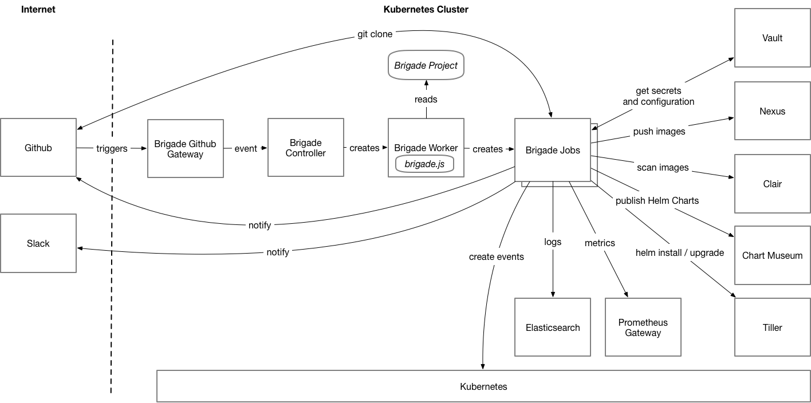

# Container Camp Workshop Proposal

Title: **Advanced CI/CD with Brigade**
Level: Advanced

**Abstract**

In this workshop I will teach how to use Helm to deploy all the workloads required for an advanced CI/CD capability based on the Microsoft Brigade project.  I will also show an example Brigade project that uses Hashicorp Vault for secrets, Sonatype Nexus for a Docker registry, CoreOS Clair for image scanning, Chart Museum as a Helm repository, Prometheus for metrics and ElasticSearch for logging.  

Participants will leave with the knowledge and reference material to be able to replicate this capability in their own organisation.

25 to 50 participants

**Participants to bring**

If participants want to leave with their own implementation of the CI/CD platform then they will need administrative access to their own Kubernetes cluster.

**Instructor Bio**

I am a passionate technologist with many years of experience in all aspects of datacentre infrastructure, automation, programming languages and developer workflows. 

• A co-organiser of the [Melbourne Kubernetes Meetup](melbkubernetes.org);
• Author of [Open Datacentre](opendatacentre.io), a Kubernetes distribution with numerous datacentre workloads;
• A Kubernetes evangelist since the early days of its release.

**Tutorial examples**

[https://open-datacentre.gitbooks.io/open-datacentre-mini/content/v/development/](https://open-datacentre.gitbooks.io/open-datacentre-mini/content/v/development/)

I started the above course to teach how to build a CI/CD platform using Jenkins.  Then Microsoft released Brigade and I decided that I wanted to focus on that instead.  So I temporarily stopped further development.

**Anything Else**

James Buckett will help to facilitate the workshop.  Which should allow for more hands on coaching and issue resolution.

I will continue development of the course I referenced in **Tutorial examples** and that will become the online reference material for this workshop.
